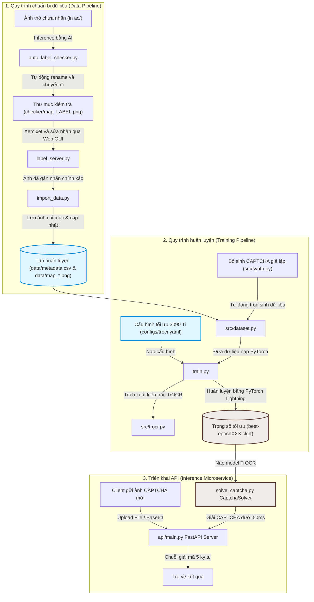

# captcha-map-solver

Hệ thống giải CAPTCHA dạng `map_*.png` (ảnh 128×128 RGBA, nhãn 5 ký tự hoa/số từ bảng chữ cái 24 ký tự) dựa trên mô hình **TrOCR (Transformers OCR)** được tinh chỉnh (fine-tuned) từ `microsoft/trocr-base-printed` (~334M parameters). 

Hệ thống hỗ trợ huấn luyện lại (training) kết hợp trộn dữ liệu giả lập (synthetic data), đồng thời đi kèm một **FastAPI Microservice** hiệu năng cao để tích hợp giải CAPTCHA trực tiếp qua API.

---

## 📊 Sơ đồ kiến trúc & Quy trình hoạt động (Workflow Diagram)



---

## 📂 Cấu trúc thư mục dự án hiện tại

```text
TrainAI/
├── api/
│   ├── main.py               # API Server FastAPI (Cổng mặc định: 5000)
│   ├── config.json           # Cấu hình checkpoint mặc định cho API
│   └── requirements.txt      # Thư viện tối giản cho môi trường API
├── configs/
│   └── trocr.yaml            # Cấu hình huấn luyện TrOCR Base tối ưu cho RTX 3090 Ti (24GB VRAM)
├── data/
│   ├── metadata.csv          # File ánh xạ tên file ảnh -> nhãn CAPTCHA thực tế
│   └── map_*.png             # Bộ dữ liệu ảnh CAPTCHA thật để huấn luyện
├── src/
│   ├── trocr.py              # Lightning Module kiến trúc TrOCR chính
│   ├── dataset.py            # Quản lý Dataset, bảng chữ cái (ALPHABET), tiền xử lý ảnh
│   ├── synth.py              # Bộ sinh ảnh CAPTCHA giả lập chất lượng cao để train bổ sung
│   ├── compare_models.py     # Script so sánh độ chính xác giữa hai checkpoint TrOCR
│   └── config.py             # Bộ tải cấu hình YAML
├── auto_label_checker.py      # Tự động gán nhãn bán phần bằng AI và chuyển vào thư mục checker/
├── import_data.py            # Nhập dữ liệu ảnh đã gán nhãn mới vào thư mục data/ & metadata.csv
├── label_server.py           # Công cụ gán nhãn CAPTCHA trực quan qua giao diện web (HTML/JS)
├── predict.py                # CLI dự đoán nhanh một ảnh CAPTCHA đơn lẻ (TrOCR)
├── solve_captcha.py          # Wrapper lớp CaptchaSolver giải CAPTCHA bằng Python API
├── train.py                  # Dòng lệnh entry-point chính để huấn luyện mô hình
├── setup.bat                 # Script tự động cấu hình môi trường ảo & cài đặt PyTorch CUDA
├── run_api.bat               # Script khởi chạy nhanh API FastAPI giải CAPTCHA
├── requirements.txt          # Danh sách thư viện Python cần thiết cho huấn luyện & bổ trợ
└── README.md                 # Hướng dẫn sử dụng này
```

---

## ⚡ Hướng dẫn cài đặt nhanh (Windows)

Dự án đã được tích hợp sẵn các file script tự động cấu hình để chạy nhanh trên Windows 10/11:

### Bước 1: Khởi tạo môi trường ảo và cài đặt thư viện
Nhấp đúp chuột vào file **`setup.bat`** hoặc mở CMD/PowerShell tại thư mục dự án và chạy:
```powershell
.\setup.bat
```
*Script này sẽ tự động kiểm tra Git, Python, phát hiện driver NVIDIA CUDA, tạo môi trường ảo `.venv` và cài đặt đúng phiên bản PyTorch CUDA phù hợp.*

### Bước 2: Chuẩn bị Checkpoint
Vì các tệp checkpoint trọng số mô hình lớn (`*.ckpt` khoảng ~1.3GB) bị bỏ qua bởi Git, bạn cần copy file checkpoint mô hình đã train (ví dụ: `best-epoch032.ckpt`) đặt vào **thư mục gốc của dự án** (`TrainAI/`).

---

## 🚀 Chạy API giải CAPTCHA

Nhấp đúp chuột vào file **`run_api.bat`** để khởi động API Server. Server sẽ chạy mặc định tại địa chỉ: `http://127.0.0.1:5000`.

### Các endpoint chính của API:

#### 1. Giải CAPTCHA bằng File ảnh (`POST /solve-file`)
* **URL**: `/solve-file`
* **Body (Multipart/Form-Data)**:
  * `file`: Tệp tin ảnh CAPTCHA `.png` hoặc `.jpg`.
* **Phản hồi mẫu**:
  ```json
  {
    "success": true,
    "captcha": "33JJP",
    "inference_time_ms": 115.42
  }
  ```

#### 2. Giải CAPTCHA bằng Base64 (`POST /solve-base64`)
* **URL**: `/solve-base64`
* **Headers**: `Content-Type: application/json`
* **Body (JSON)**:
  ```json
  {
    "image_base64": "iVBORw0KGgoAAAANSUhEUgAAAGAAA..."
  }
  ```
* **Phản hồi mẫu**:
  ```json
  {
    "success": true,
    "captcha": "33JJP",
    "inference_time_ms": 98.15
  }
  ```

#### 3. Kiểm tra trạng thái hệ thống (`GET /health`)
* **URL**: `/health`
* **Phản hồi mẫu**:
  ```json
  {
    "status": "healthy",
    "device": "cuda",
    "checkpoint": "best-epoch032.ckpt"
  }
  ```

---

## 🏋️ Huấn luyện mô hình (Training)

Nếu bạn có thêm ảnh CAPTCHA mới và muốn huấn luyện lại mô hình để đạt độ chính xác cao hơn:

### 1. Huấn luyện tiêu chuẩn (Dùng dữ liệu thật trong thư mục `data`)
Kích hoạt môi trường ảo và khởi chạy file `train.py` với cấu hình TrOCR tối ưu cho RTX 3090 Ti:
```powershell
.\.venv\Scripts\python train.py --config configs/trocr.yaml
```

### 2. Huấn luyện nâng cao (Trộn dữ liệu giả lập tự sinh sinh động)
Bộ sinh CAPTCHA giả lập (`src/synth.py`) có khả năng tự vẽ hàng ngàn mẫu CAPTCHA ngẫu nhiên giống hệt phân phối ảnh thật về màu nền, nét gạch nhiễu, fonts chữ và độ xoay chữ.

Để huấn luyện kết hợp tự động trộn **2000 ảnh giả lập trên mỗi epoch** (được khuyến nghị để chống overfit):
```powershell
.\.venv\Scripts\python train.py --config configs/trocr.yaml --synth 2000
```

---

## 🛠️ Các công cụ bổ trợ và quy trình gán nhãn

Dưới đây là các script Python bổ trợ hữu ích phục vụ quy trình chuẩn bị dữ liệu và gán nhãn:

### 1. Nhập dữ liệu đã gán nhãn (`import_data.py`)
Đọc các ảnh đã được gán nhãn thủ công từ thư mục nguồn (ví dụ: `ac/` với định dạng tên `map_[NHAN].png`), tự động đổi tên thành mã số tuần tự (ví dụ: `map_01520.png`), copy vào thư mục `data/` và cập nhật thông tin nhãn vào `data/metadata.csv`. Script tự động bỏ qua các ảnh có nhãn đã tồn tại trong metadata để tránh trùng lặp.
```powershell
.\.venv\Scripts\python import_data.py --dir ac
```

### 2. Công cụ gán nhãn CAPTCHA giao diện Web (`label_server.py`)
Khởi chạy một web server gọn nhẹ để bạn gán nhãn/chỉnh sửa nhãn CAPTCHA trực quan qua trình duyệt. Hỗ trợ hai chế độ:
- **CSV Mode**: Tự động phát hiện `metadata.csv` trong thư mục chỉ định và chỉnh sửa trực tiếp trên file CSV.
- **Renaming Mode**: Nếu không có file CSV, công cụ sẽ hiển thị ảnh và cho phép gán nhãn bằng cách đổi tên file trực tiếp thành `map_[LABEL].png`.
```powershell
.\.venv\Scripts\python label_server.py --dir ac
```

### 3. Tự động gán nhãn bán phần (`auto_label_checker.py`)
Sử dụng mô hình TrOCR đã huấn luyện để dự đoán nhanh hàng loạt ảnh CAPTCHA thô chưa gán nhãn trong thư mục `ac/`, đổi tên chúng thành dạng chứa nhãn dự đoán `map_[DỰ_ĐOÁN].png` và chuyển sang thư mục `checker/` để con người dễ dàng xem xét, hiệu chỉnh lại thông qua `label_server.py`.
```powershell
.\.venv\Scripts\python auto_label_checker.py
```

### 4. So sánh hiệu năng và độ chính xác (`src/compare_models.py`)
Chạy đánh giá song song và so sánh chi tiết độ chính xác của hai checkpoint mô hình TrOCR khác nhau (ví dụ: checkpoint cũ `best-epoch032.ckpt` và checkpoint mới `best-epoch072.ckpt`) trên một tập ảnh test có sẵn nhãn. Tự động nhận diện và giải quyết các lỗi cấu trúc state dict khác nhau giữa các phiên bản thư viện transformers (tự động remap các tensor trọng số).
```powershell
.\.venv\Scripts\python src/compare_models.py --ckpt1 best-epoch032.ckpt --ckpt2 best-epoch072.ckpt --dir ac
```

### 5. Dự đoán nhanh qua CLI (`predict.py`)
Thực hiện dự đoán nhãn CAPTCHA cho một ảnh cụ thể bằng mô hình TrOCR trực tiếp thông qua giao diện dòng lệnh:
```powershell
.\.venv\Scripts\python predict.py --ckpt best-epoch032.ckpt --image data/map_00000.png --task trocr
```

---

## 📝 Giấy phép
Dự án được phân phối dưới giấy phép MIT. Quy trình gán nhãn và kiến trúc fine-tuning tối ưu dựa trên phân tích cấu trúc thực tế của CAPTCHA.
